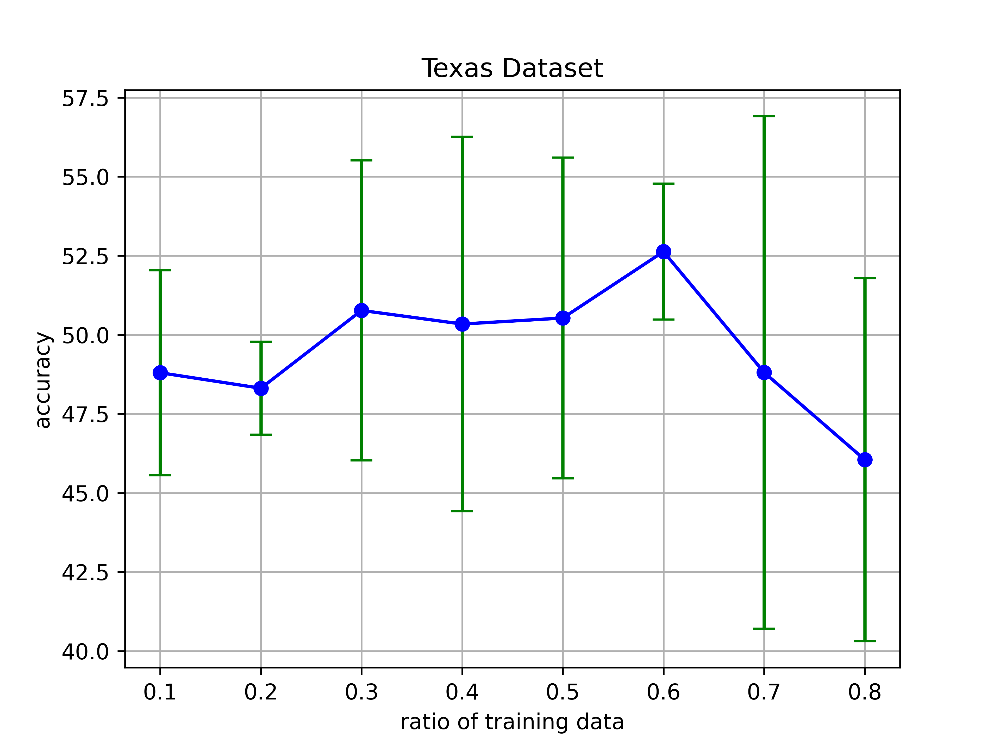
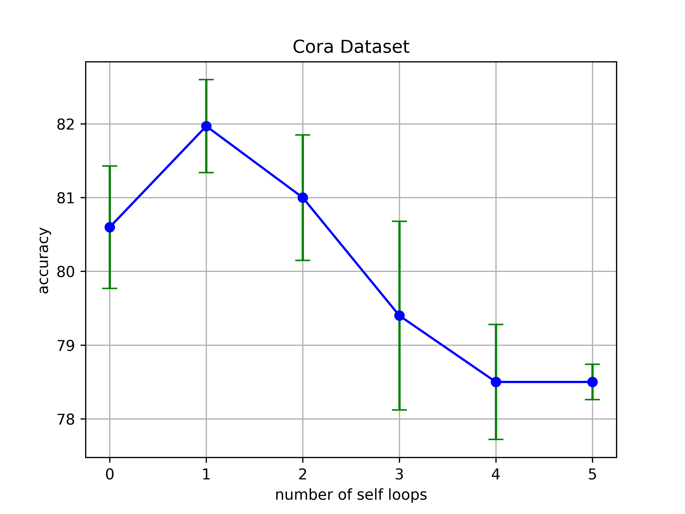
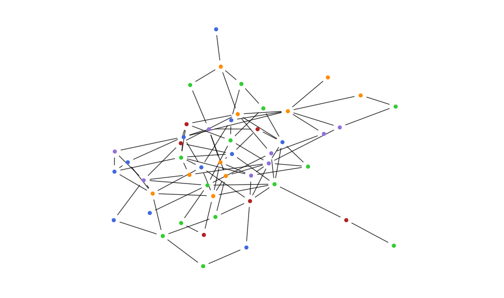

# Week 3
## Missions
1. 学习PyG Documentation，学会用 PyG 的Planetoid加载 cora等数据，理解 dataset 和 data各自封装了什么数据，以及如何添加自定义的数据
   1. 使用Planetoid 加载 cora等数据
      ```py
      >>> dataset = Planetoid(root = 'data/' + 'Cora', name = 'Cora')
      # you can also choose 'Citeseer' & 'PubMed'
      ```
   2. `torch_geometric.data` 和 `torch_geometric.datasets` 是 PyG（PyTorch Geometric）库中用于处理图数据的两个重要模块。它们分别封装了不同的数据结构和功能
      1. `torch_geometric.data` 模块：用于封装单个图数据。偏向于提供图数据的基本数据结构，数据的自主创建还有其他辅助函数和工具：例如图转换函数、数据加载和保存函数等
      2. `torch_geometric.datasets` 模块：用于封装多个图数据，以及一些具体的常用的数据集类，例如 `Planetoid`。`dataset`是一组图，`data = dataset[i]`是取其中的第 `i` 个图
   3. 添加自定义数据：像上面提到的，运用 `torch_geometric.data` 类可以创建一个基本的图数据类型
      ```py
      >>> from torch_geometric.data import Data

      >>> x = torch.tensor([[0.0], [1.0], [2.0], [3.0]])     # 节点特征
      >>> edge_index = torch.tensor([[0, 1, 2], [1, 2, 3]])  # 边索引
      # 表示索引0和1，1和2，2和3各有一条边相连接
      >>> y = torch.tensor([0, 1, 0, 1])                     # 自定义标签

      >>> custom_data = Data(x=x, edge_index=edge_index, y=y)
      Data(x=[4, 1], edge_index=[2, 3], y=[4])
      ```
2. cora是有向图还是无向图？如何将有向图转换为无向图？如何对图数据进行增边、减边？
   1. 查看数据集是否为有向图还是无向图
      ```py
      >>> data = dataset[0]   # get the first graph(cora has only one graph)
      >>> data.is_undirected()
      True
      ```
      说明 cora 数据集是无向图
   2. 转换有向图为无向图：用 `torch_geometric.utils.to_undirected` 函数可以将有向图转换为无向图
      ```py
      >>> edge_index = torch.tensor([[0, 1, 1],
      ...                            [1, 0, 2]])
      >>> to_undirected(edge_index)
      tensor([[0, 1, 1, 2],
              [1, 0, 2, 1]])
      ```
   3. 对图数据进行增边、减边：
      ```py
      >>> edge_index = torch.tensor([[0, 1], [1, 0]], dtype=torch.long)
      >>> data = Data(edge_index=edge_index)

      # 增边
      >>> new_edge = torch.tensor([[1, 2], [2, 1]], dtype=torch.long)
      >>> data.edge_index = torch.cat([data.edge_index, new_edge], dim=1)
      tensor([0, 1, 1, 2], 
             [1, 0, 2, 1])

      # 减边：通过掩码留下要保留的边，那么就删除了边，例如 删除[1, 2]边
      >>> mask = (data.edge_index[0] != 1) | (data.edge_index[1] != 2)
      >>> data.edge_index = data.edge_index[:, mask]  
      tensor([[0, 1, 2],
              [1, 0, 1]])
      ```
      
3. 以同质图 cora 和异质图texas 为例，学会数据集划分方式：（`repartition_cora_GCN.py` 和 `repartition_texas_GCN.py`）
   1. 以Cora数据集为例
      | 划分方式train:val:test | 1:4.5:4.5 | 2:4:4 | 3:3.5:3.5 | 4:3:3 | 5:2.5:2.5|6:2:2| 7:1.5:1.5|8:1:1|
      |:--:|:---:|:---:|:---:|:---:|:---:|:---:|:---:|:---:|
      | 准确率                 | 81.70 ± 1.48 | 83.51 ± 1.01 | 84.07 ± 0.50 | 85.98 ± 0.66 | 85.28 ± 1.10 | 87.48 ± 1.20 | 87.96 ± 1.64 | 87.26 ± 2.80 |

      可以看到训练集占比越高，模型准确率越高，但是过高会导致模型过拟合，从而在测试阶段产生不稳定的现象。因此训练集测试集的占比应该在一个合理的区间范围内
   2. 以Texas数据集为例
      | 划分方式train:val:test | 1:4.5:4.5 | 2:4:4 | 3:3.5:3.5 | 4:3:3 | 5:2.5:2.5|6:2:2| 7:1.5:1.5|8:1:1|
      |:--:|:---:|:---:|:---:|:---:|:---:|:---:|:---:|:---:|
      | 准确率                 | 48.80 ± 3.24 | 48.31 ± 1.47 | 50.77 ± 4.74 | 50.34 ± 5.92 | 50.53 ± 5.07 | 52.63 ± 2.15 | 48.81 ± 8.1 | 46.05 ± 5.74 |

      可以看到训练集占比越高，模型准确率越高，但是过高（过了6:2:2）会导致模型过拟合，从而在测试阶段产生极其不稳定的现象，而且准确率会下降。因此训练集测试集的占比应该在一个合理的区间范围内
4. 如何添加自环（self_loop）？加自环有什么用？对应GCN论文里的哪一步？加自环与不加自环、以及加几次自环，对GCN节点分类的效果有什么影响？
   1. 如何添加自环：
      1. 运用 `torch_geometric.utils.add_self_loops`
         ```py
         >>> edge_index = torch.tensor([[0, 1, 0],
         ...                            [1, 0, 0]])
         >>> edge_weight = torch.tensor([0.5, 0.5, 0.5])
         >>> add_self_loops(edge_index)
         (tensor([[0, 1, 0, 0, 1],
                  [1, 0, 0, 0, 1]]), None)
         ```
      2. GCN源码实现是通过邻接矩阵加上对应规模的单位阵实现的，即 $\tilde{A} = A + I_N$
      3. 后面又发现加载数据集的时候，也可以做一些预处理，其中包括加入自环：
         ```py
         from torch_geometric.datasets import Planetoid
         import torch_geometric.transforms as T

         dataset = Planetoid(root='data/Cora', name='Cora', transform=T.AddSelfLoops())
         ```
   2. 加自环的用处：增强节点的自身特征：自环使得节点考虑自身的特征信息，在聚合邻居信息的同时不会忽略自身本来的特征
   3. 以cora数据集为例，测试自环多少对GCN准确率的影响
      ```py
      # which in data.py in week1 code
      def preprocess_adj(adj):
         number_of_loops = 1     # select your number of self loop
         adj_normalized = normalize_adj(adj + number_of_loops * sp.eye(adj.shape[0]))
         return sparse_to_tuple(adj_normalized)
      ```
      | self_loop | 0 | 1 | 2 | 3 | 4 | 5 |
      |:---------:|:-:|:-:|:-:|:-:|:-:|:-:|
      |accuracy   | 80.6 ± 0.83 | 81.97 ± 0.63 | 81.00 ± 0.85 | 79.4 ± 1.28 | 78.5 ± 0.78 | 78.5 ± 0.24 | 

       可以看到添加一次自环的表现最好；不添加自环，缺少节点自身的信息；过分添加自环，邻居节点的信息的作用又会被压制
5. 如何对邻接矩阵正则化？ $D^{-1}A$和 $D^{-1/2}AD^{-1/2}$ 分别怎么实现？
   1. 对称归一化：即 $D^{-1/2}AD^{-1/2}$
      ```py
      def normalize_adj(adj):
         """ Symmetrically normalize adjacency matrix """
         rowsum = np.array(adj.sum(1)) # D
         d_inv_sqrt = np.power(rowsum, -0.5).flatten() # D^-0.5
         d_inv_sqrt[np.isinf(d_inv_sqrt)] = 0.
         d_mat_inv_sqrt = sp.diags(d_inv_sqrt) # D^-0.5, to matrix
         # D^-0.5AD^0.5 <- (A D^-0.5)^T D^-0.5
         return adj.dot(d_mat_inv_sqrt).transpose().dot(d_mat_inv_sqrt)
      ```
   2. 随机游走归一化：即 $D^{-1}A$
      ```py
      def normalize_adj(adj):
         """ Symmetrically normalize adjacency matrix """
         rowsum = np.array(adj.sum(1)) # D
         d_inv = np.power(rowsum, -1).flatten() # D^-1
         d_inv[np.isinf(d_inv)] = 0.
         d_mat_inv = sp.diags(d_inv) # D^-1, to matrix
         # D^-1 A
         return adj.dot(d_mat_inv).transpose()
      ```
6. cora 和 texas 的节点特征是怎样的？加载时使用 transforms 有什么作用？
   1. cora节点特征：cora数据集的节点特征是一个1433维的二值特征向量，每个元素表示一个词汇是否在论文中出现。包含7个类别，每个节点都有一个类别标签。
   2. texas节点特征：texas数据集的节点特征是一个1703维的二值特征向量，每个元素表示一个词汇是否在论文中出现。包含5个类别，每个节点都有一个类别标签。
   3. 加载数据集时使用transforms参数还有其他的方式。
      1. `T.NormalizeFeatures()` ： 进行特征归一化处理，将节点特征进行归一化，使得特征的均值为0，方差为1，提高模型的训练效果和稳定性
      2. `T.NormalizeScale()` ：对邻接矩阵进行对称归一化处理
      3. `T.AddSelfLoops()` ：为图数据添加自环（self-loop），即将每个节点与自身连接的边添加到邻接矩阵中
      4. `T.ToSparseTensor()` ：将图数据转换为稀疏张量表示
      5. `T.Compose()` ：可以将多个transforms函数组合在一起，按顺序对数据进行处理
         ```python
         from torch_geometric.datasets import Planetoid
         import torch_geometric.transforms as T

         transform = T.Compose([T.NormalizeFeatures(), T.AddSelfLoops()])
         dataset = Planetoid(root='data/Cora', name='Cora', transform=transform)
         ```
7. 掌握 pyg 构建图数据（节点、边、类别、特征等）的方法，并尝试自己构造一个图数据。
   1. 输入节点数量、节点类别数量和边的数量，生成一张随机图
      ```py
      import torch
      import torch_geometric
      from torch_geometric.utils import to_undirected
      import networkx as nx
      import matplotlib.pyplot as plt

      colors = ['royalblue', 'darkorange', 'mediumpurple', 'limegreen', 'firebrick']

      def visualize_graph(data, title):
         G = torch_geometric.utils.to_networkx(data)
         plt.figure(figsize=(10, 10))
         pos = nx.spring_layout(G, seed=42)
         for i, color in enumerate(colors):
            nodes = [node for node in G.nodes() if data.y[node] == i]
            nx.draw_networkx_nodes(G, pos, nodelist=nodes, node_color=color, node_size=20)
         nx.draw_networkx_edges(G, pos, width=1.0, alpha=0.5, arrowstyle='-')
         plt.axis('off')
         plt.savefig(title + '.png', dpi = 600)
         plt.show()

      if __name__ == '__main__':
         num_nodes = 50  
         num_classes = 5  
         num_edges = 100  

         x = torch.randn(num_nodes, 16) # 随机生成节点特征

         y = torch.randint(num_classes, (num_nodes,)) # 随机生成节点类别

         edge_index = torch.randint(num_nodes, (2, num_edges)) # 随机生成边的索引
         edge_index = to_undirected(edge_index)

         data = torch_geometric.data.Data(x=x, y=y, edge_index=edge_index)
         visualize_graph(data, 'random_graph1')
      ```
   2. 利用 `networkx` 和 `matplotlib` 进行可视化验证结果 

## Conference
1. [Pytorch-Geometric](https://pytorch-geometric.readthedocs.io/en/latest/index.html)
2. [GCN学习笔记：第一部分，手把手用Numpy实现GCN](https://blog.csdn.net/weixin_42052081/article/details/89108966)
3. [PyG学习——使用Cora数据集](https://zhuanlan.zhihu.com/p/589748231)
