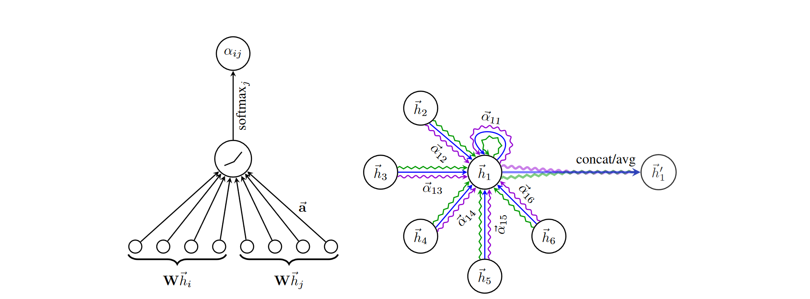

# Week4 GAT
## Graph Attention Networks

### Motivation

- 对于非欧结构的图数据，原有的卷积模型无法使用，因此有了后续GNN模型，传统的GNN（如GCN）在处理图数据时，对每个节点的邻居节点赋予相同的权重，这可能导致在图中捕捉复杂的、多样化的节点关系时存在限制
    
- 受RNN中注意力机制的启发，引入注意力机制来动态地计算每个节点与其邻居节点之间的权重
    

### Methodology

- 建模过程
    
    - 注意力系数 
        $$
        e_{ij} = a(\mathbf{W}\vec{h}_i, \mathbf{W}\vec{h}_j)
        $$ 
        $\vec{h}$是节点特征
        
    - 归一化
        $$
        a_{ij} = \text{softmax}_{j}(e_{ij}) = \frac{\text{exp}(e_{ij})}{\sum_{k\in \mathcal{N}}\text{exp}(e_{ik})}
        $$
        
    - 将系数$a$改为可训练的神经网络，变成一个权重向量$\vec{a}$ ，向量内积运算改为向量拼接运算 
        $$
        \alpha_{i j}=\frac{\exp \left(\operatorname{LeakyReLU}\left(\overrightarrow{\mathbf{a}}^{T}\left[\mathbf{W} \vec{h}_{i} \| \mathbf{W} \vec{h}_{j}\right]\right)\right)}{\sum_{k \in \mathcal{N}_{i}} \exp \left(\operatorname{LeakyReLU}\left(\overrightarrow{\mathbf{a}}^{T}\left[\mathbf{W} \vec{h}_{i} \| \mathbf{W} \vec{h}_{k}\right]\right)\right)}
        $$
        
    - 多头注意力机制（拼接，用在隐藏层）
        $$
        \vec{h}_{i}^{\prime}=\|_{k=1}^{K} \sigma\left(\sum_{j \in \mathcal{N}_{i}} \alpha_{i j}^{k} \mathbf{W}^{k} \vec{h}_{j}\right)
        $$

    - 多头注意力机制（取平均，用在最后一层，预测的时候就不用拼接了）
        $$
        \vec{h}_{i}^{\prime}= \sigma\left(\frac{1}{K}\sum_{k=1}^K\sum_{j \in \mathcal{N}_{i}} \alpha_{i j}^{k} \mathbf{W}^{k} \vec{h}_{j}\right)
        $$
        

### Experiment

- transductive learning: 作者测试了cora，citeseer，pubmed数据集
    
- inductive learning：作者测试了PPI数据集
    

### Conclusion

- GAT 是一种新颖的卷积式神经网络，用于处理图结构数据。它利用掩码式自注意力层，通过计算效率高、可并行化处理的图注意力层，实现对图数据的表示学习。
    
- **特点：** GAT 中的图注意力层是计算上高效的，不需要昂贵的矩阵运算，可以在图中的所有节点上并行运行。它允许为邻域内的不同节点分配不同的重要性，同时处理不同大小的邻域，而且不需要预先了解整个图结构。
    
- **性能：** GAT 模型利用注意力机制成功地在四个常见的节点分类基准任务上达到或匹配了最先进的性能，包括传统归纳式和归纳式测试中使用全新图形的情况。这表明GAT在多个应用中具有出色的性能。
    
- **未来工作：** 作者指出了一些潜在的改进和扩展方向。这包括解决批处理大小的实际问题，进行模型可解释性分析，扩展到图分类任务，以及支持边特征以解决更广泛的问题。
    

## GAT in Pytorch
- [GAT_pyg.py](GAT_pyg.py) 是使用Pytorch框架的GAT模型，测试数据集为Cora数据集
- result
    | rounds | 1  | 2  | 3  | 4  | 5  | 6  | 7  | 8  | 9  | 10 |
    |:------:|:--:|:--:|:--:|:--:|:--:|:--:|:--:|:--:|:--:|:--:|
    |accuracy|81.3|82.3|81.6|80.9|83.3|81.8|80.6|82.5|81.7|82.0|
  
    average: **81.8 ± 0.75**

## GCN & GAT with my own `Conv` layers
### GCN
- GCN模型公式
  $$
  H^{(l + 1)} = \sigma(\tilde{D}^{-1/2}(A + I_N)\tilde{D}^{-1/2}H^{(l)}W^{(l)})
  $$
- GCNConv: [GCN_own.py](GCN_own.py)
  ```py
  class GCNConv(torch.nn.Module):
    def __init__(self, in_channels, out_channels):
        super(GCNConv, self).__init__()
        self.in_channels = in_channels
        self.out_channels = out_channels
        self.weight = torch.nn.Parameter(torch.nn.init.xavier_uniform_(torch.empty(in_channels, out_channels)))

    def forward(self, x, edge_index):
        adj = self.normalize_adjacency(edge_index)
        x = torch.mm(adj, x)
        x = torch.mm(x, self.weight)
        return x

    def normalize_adjacency(self, edge_index, self_loops = 1):
        num_nodes = torch.max(edge_index) + 1
        adj = torch.zeros((num_nodes, num_nodes))
        
        for i, j in zip(edge_index[0], edge_index[1]):
            adj[i, j] = adj[j, i] = 1

        for _ in range(self_loops):
            adj += torch.eye(num_nodes)

        degree = torch.sum(adj, dim=1)
        degree_sqrt_inv = torch.diag(1 / torch.sqrt(degree))
        adj_normalized = torch.mm(torch.mm(degree_sqrt_inv, adj), degree_sqrt_inv)
        return adj_normalized
  ```
- 以上 `Conv` 层，额外实现了可以设置添加自环个数
- 存在问题：代码运行速度慢

### GAT
todo
